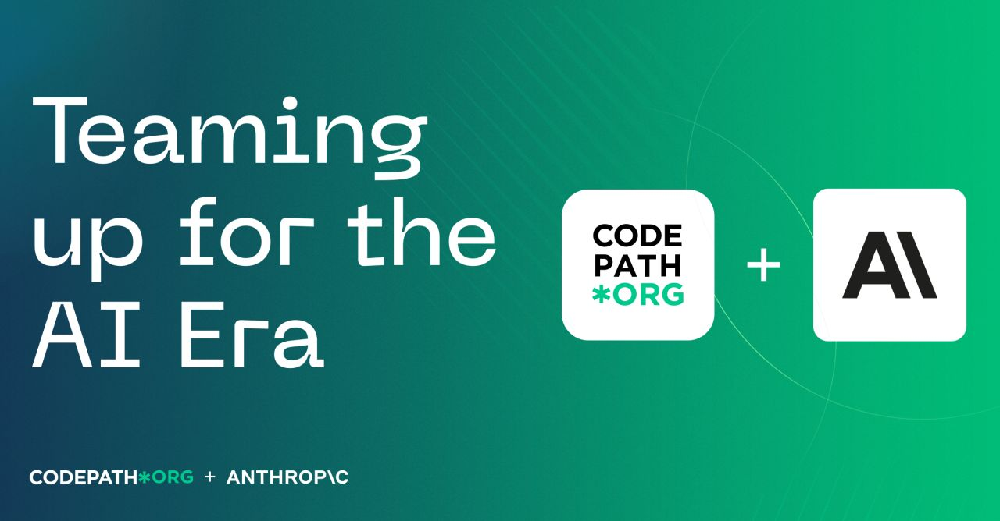

# Applied AI – CodePath x Anthropic


Weekly hands-on exercises from the **Applied AI** course, a collaboration between [CodePath](https://www.codepath.org/) and [Anthropic](https://www.anthropic.com/). Each session focuses on building practical skills with large language models through real coding challenges.

**Stack:** Python · Claude API · Streamlit

---

## 📁 Course Exercises

| Week | Project | Topics Covered |
|------|---------|---------------|
| 01 | [Playlist Chaos](./week-01-playlist-chaos) | AI-assisted debugging, prompt engineering, Python |
| 02 | [Game Glitch Investigator](./week-02-gameglitch-investigator) | Claude API, AI-powered debugging, Streamlit |
| 03 | [ByteBites](./week-03-bytebites) | OOP design, UML diagrams, Python classes, AI collaboration |

*Updated weekly throughout the course.*

---

## How to Run Any Exercise

Each week folder contains its own `requirements.txt`. To run locally:

```bash
cd week-XX-topic-name
python3 -m venv .venv
source .venv/bin/activate
pip install -r requirements.txt
streamlit run app.py
```

---

## About This Course

Applied AI is a project-based course exploring how to build and reason about AI-powered applications. Topics include:

- Prompt engineering and AI-assisted development
- Debugging and improving LLM-powered apps
- Building with the Claude API

---

*Paloma Santos · Spring 2026*
