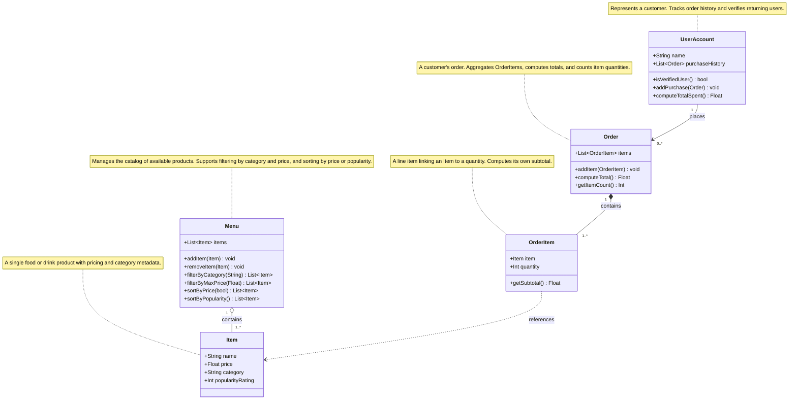

```mermaid
classDiagram
    class UserAccount {
        +String name
        +List~Order~ purchaseHistory
        +isVerifiedUser() bool
        +addPurchase(Order) void
        +computeTotalSpent() Float
    }
    note for UserAccount "Represents a customer. Tracks order history and verifies returning users."

    class Menu {
        +List~Item~ items
        +addItem(Item) void
        +removeItem(Item) void
        +filterByCategory(String) List~Item~
        +filterByMaxPrice(Float) List~Item~
        +sortByPrice(bool) List~Item~
        +sortByPopularity() List~Item~
    }
    note for Menu "Manages the catalog of available products. Supports filtering by category and price, and sorting by price or popularity."

    class Item {
        +String name
        +Float price
        +String category
        +Int popularityRating
    }
    note for Item "A single food or drink product with pricing and category metadata."

    class OrderItem {
        +Item item
        +Int quantity
        +getSubtotal() Float
    }
    note for OrderItem "A line item linking an Item to a quantity. Computes its own subtotal."

    class Order {
        +List~OrderItem~ items
        +addItem(OrderItem) void
        +computeTotal() Float
        +getItemCount() Int
    }
    note for Order "A customer's order. Aggregates OrderItems, computes totals, and counts item quantities."

    UserAccount "1" --> "0..*" Order : places
    Menu "1" o-- "1..*" Item : contains
    Order "1" *-- "1..*" OrderItem : contains
    OrderItem ..> Item : references
```
