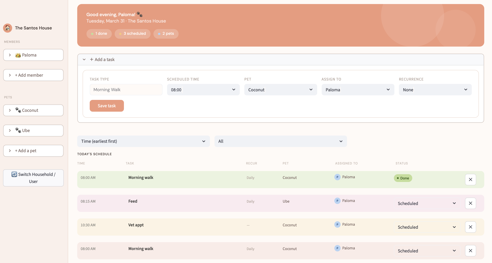

# PawPal+ — Collaborative Pet Task Management System

**PawPal+** is a real-time multi-household pet care task management platform built with Streamlit and a custom scheduling engine. It helps families, roommates, and pet-sitting services coordinate pet care, prevent scheduling conflicts, and delegate tasks intelligently.

## The Problem

Coordinating pet care across multiple people is chaotic:
- **Scheduling conflicts** — Two people assigned to walk the same dog at the same time
- **Manual rescheduling** — Recurring tasks like daily walks require tedious re-entry
- **Communication gaps** — No easy way to ask for help when plans change
- **Lost accountability** — No record of who completed what task

## The Solution

PawPal+ solves each problem with intelligent scheduling, conflict detection, and collaborative task delegation.

## Core Features

### 🔀 Intelligent Conflict Detection
- Real-time validation prevents scheduling conflicts instantly
- Detects **same-pet conflicts** (a pet can't do two tasks at once)
- Detects **same-assignee conflicts** (a person can't be in two places at once)

### 🔄 Recurring Task Automation
- Tasks recur automatically on daily or weekly schedules
- New task instances inherit pet, type, assignee, and recurrence pattern
- Handles edge cases: leap years, month boundaries

### 🎯 Smart Task Sorting & Filtering
- Sort by: **time**, **assignee name**, **pet name**
- Filter by: **status** (scheduled/completed), **pet**, **household member**
- Scales efficiently to 100+ tasks

### 📣 Collaborative Task Delegation (Ping System)
- Users can ping household members to request help with a task
- Recipients can **accept** or **decline**
- Tasks automatically reassign to accepter upon confirmation
- State machine prevents invalid transitions

### 👥 Multi-User Household Management
- Unlimited household members with distinct availability schedules
- Members can have different availability windows (e.g., "9am-5pm weekdays")
- Task assignments respect user availability constraints

### 🐾 Pet Profile Management
- Store comprehensive pet info: breed, age, veterinarian, vet phone
- Add/remove pets dynamically as household needs change
- Support for multiple pets per household

### ✅ Task Completion & History
- Mark tasks complete with single click
- Automatic recurrence trigger for recurring tasks
- Completion timestamps for user accountability

## Demo



*PawPal+ dashboard showing task management interface with conflict detection and multi-user household support.*


## Getting Started

### Setup

```bash
python -m venv venv
source venv/bin/activate  # Windows: venv\Scripts\activate
pip install -r requirements.txt
```

### Running the App

```bash
streamlit run app.py
```

Opens at `http://localhost:8501`

### Running Tests

```bash
PYTHONPATH=. python -m pytest tests/test_pawpal.py -v
```

## Test Coverage: 69 Tests, 100% Pass Rate

| Category | Tests | Coverage |
|----------|-------|----------|
| **Conflict Detection** | 16 | Same-pet, same-assignee, edge cases |
| **Recurring Tasks** | 15 | Daily/weekly patterns, property inheritance |
| **Filtering & Queries** | 13 | Status, pet, member filters |
| **Notification Workflow** | 12 | State machine, double-acceptance prevention |
| **Task Sorting** | 9 | Chronological ordering, immutability |
| **Integration** | 5 | Complex scenarios with 10+ recurring tasks |
| **TOTAL** | **69** | **100% pass rate** |

## Confidence Level: 4/5

**What's Solid ✅**
- 69 comprehensive tests (100% pass rate)
- Core scheduling logic fully validated
- Robust edge case handling (leap years, midnight boundaries, microsecond precision)
- Clean separation of business logic from UI
- State machine for notifications is production-ready

**What's Incomplete ⚠️**
- No persistence layer (in-memory only; tasks lost on refresh)
- Streamlit UI untested at scale (works for ~100 tasks, unclear at 1000+)
- All queries O(n) scans (acceptable for current scale)
- No production logging/monitoring

**To Reach 5/5:**
1. Add database persistence (SQLite, PostgreSQL, or Firebase)
2. Implement indexed queries for pet-based lookups
3. Add caching for availability parsing
4. Deploy with monitoring and error tracking
5. Load testing with 10k+ tasks

## Technical Architecture

**Backend:** Pure Python dataclass-based system
- `User` — Household members with availability schedules
- `Household` — Container for users and pets
- `Pet` — Pet profiles with vet information
- `Task` — Pet care tasks with recurrence and assignments
- `Notification` — Ping system for task delegation
- `Scheduler` — Conflict detection, sorting, filtering, availability matching

**Frontend:** Streamlit with custom CSS design system
- DM Sans typography
- Warm color palette (#F0997B coral, #FFFAF7 cream, #FBF0EA sage)
- Responsive layout with right-aligned sidebar
- Real-time task status updates

**State Management:** Streamlit session state with immutable patterns

## Project Structure

```
week-04-pawpal/
├── app.py                    # Streamlit UI with custom CSS design
├── pawpal_system.py          # Core scheduling engine + data models
├── tests/
│   └── test_pawpal.py        # 69 comprehensive pytest tests
├── README.md
├── reflection.md             # Design decisions & lessons learned
├── uml_final.png             # Updated UML class diagram
└── requirements.txt
```

## Built For

- 👨‍👩‍👧‍👦 Families managing shared pet care responsibilities
- 🏢 Pet-sitting and dog-walking services coordinating staff
- 🐾 Anyone with multiple people and multiple pets who needs scheduling help 
